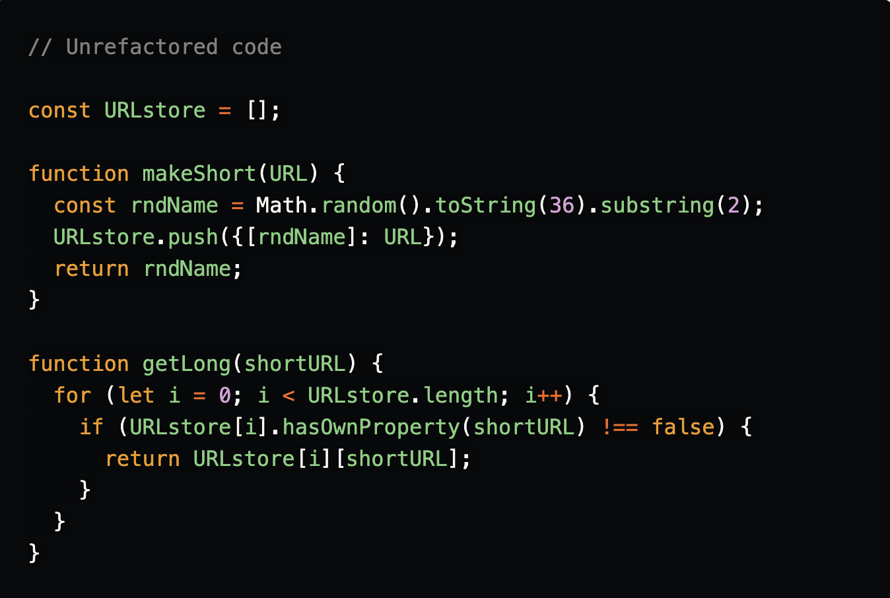
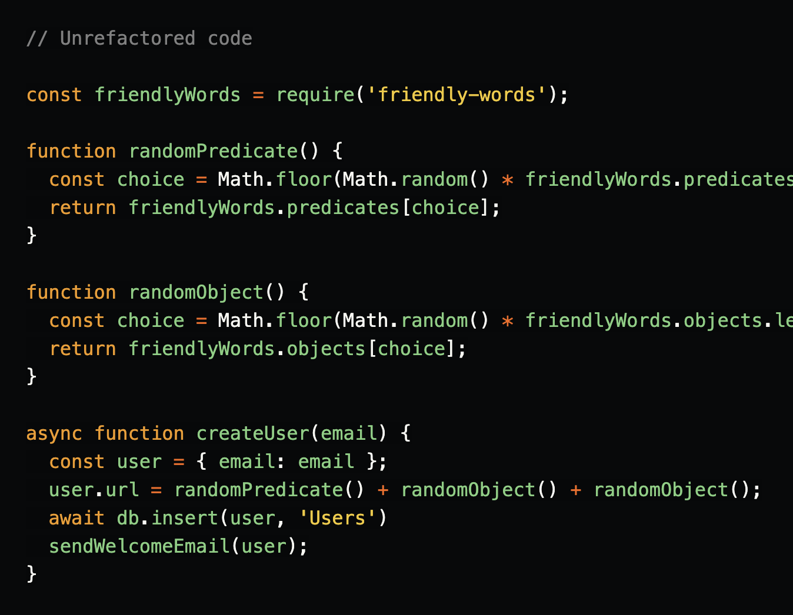

# FUNCTIONAL PROGRAMMING

**Concepts of Functional Programming in Javascript:**

- Doing some research, I found functional programming concepts like immutability and pure function. Those concepts are big advantages to build side-effect-free functions, so it is easier to maintain systems — with some other benefits.

**What is functional programming?**

- Functional programming is a programming paradigm — a style of building the structure and elements of computer programs — that treats computation as the evaluation of mathematical functions and avoids changing-state and mutable data.

**Pure functions:**

- How do we know if a function is pure or not? Here is a very strict definition of purity:

1- It returns the same result if given the same arguments (it is also referred as deterministic).

2- It does not cause any observable side effects

**Immutability:**

- When data is immutable, its state cannot change after it’s created. If you want to change an immutable object, you can’t. Instead, you create a new object with the new value.

- In Javascript we commonly use the for loop. This next for statement has some mutable variables.

**Referential transparency:**

- This pure function will always have the same output, given the same input.

- Basically, if a function consistently yields the same result for the same input, it is referentially transparent.

- pure functions + immutable data = referential transparency
With this concept, a cool thing we can do is to memoize the function. Imagine we have this function:

**Functions as first-class entities:**

- The idea of functions as first-class entities is that functions are also treated as values and used as data.
Functions as first-class entities can:
refer to it from constants and variables
pass it as a parameter to other functions
return it as result from other functions
The idea is to treat functions as values and pass functions like data. This way we can combine different functions to create new functions with new behavior.

**Higher-order functions:**

- When we talk about higher-order functions, we mean a function that either:
takes one or more functions as arguments, or
returns a function as its result.

**Filter:**

- Given a collection, we want to filter by an attribute. The filter function expects a true or false value to determine if the element should or should not be included in the result collection. Basically, if the callback expression is true, the filter function will include the element in the result collection. Otherwise, it will not.

**Refactoring JavaScript for Performance and Readability:**

- Scenario 1

We're an URL-shortening website, like TinyURL. We accept a long URL and return a short URL that forwards visitors to the long URL. We have two functions.

- Scenario 2

We're a social media website where user URLs are generated randomly. Instead of random gibberish, we're going to use the friendly-words package that the Glitch team works on. They use this to generate the random names for your recently created projects:

