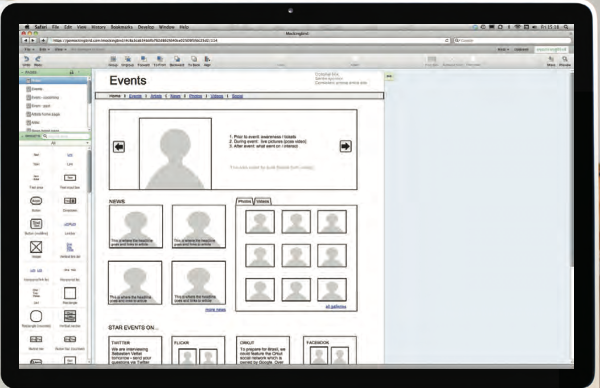

# This section discusses a process that you can use when you are creating a new website

- It looks at who might be visiting your site and how to ensure the pages feature the information those visitors need. It also covers some key aspects of design theory to help you create professional looking sites. In this chapter , lock at this :

--------------

**Who is the site For?**

*Every website should be designed for the target audience—not just for yourself or the site owner. It is therefore very important to understand who your target audience is.*

**Target audience for this :**

*1 - nDiviDuals .*  
*2 - comPanies .*

**Why People visit your website:**

*1 - The first attempts to discover the underlying motivations for why visitors come to the site.*

*2 - The second examines the specific goals of the visitors. These are the triggers making them come to the site now.*

**What your visitors are trying to achieve :**

*You want to create a list
of reasons why people would be coming to your site.*

**What inFormation your visitors neeD :**

*You know who is coming to your site and why they are coming, so now you need to work out what information they need in order to achieve their goals quickly and effectively like :*

- You may want to offer additional supporting information that you think they might find helpful.
- Look at each of the reasons why people will be visiting your site and determine what they need to achieve their goals.
- You can prioritize levels of information from key points down to non-essential or background information.
- By ensuring that you provide the information that your visitors are looking for, they will consider your site more relevant to them.

**How often people Will visit your site :**

- A website will need to change a  frequently .

**Site maps :**

*The aim is to create a diagram of the pages that will be used to structure the site. This is known as a site map and it will show how those pages can be grouped.*

**WireFrames :**

*A wireframe is a simple sketch of the key information that needs to go on each page of a site. It shows the hierarchy of the information and how much space it might require.*

**Getting your message across using Design :**

- The primary aim of any kind of visual design is to communicate. Organizing and prioritizing information on a page helps users understand its importance and what order to read it in.

**visual hierarchy :**  

- 1- *Size
Larger elements will grab users' attention first. For this reason it is a good idea to make headings and key points relatively large.*

- 2- *color
Foreground and background color can draw attention to key messages. Brighter sections tend to draw users' attention first.*

- 3- *style
An element may be the same size and color as surrounding content but have a different style applied to it to make it stand out.*

**Grouping and similarity :**

- *We naturally observe similarities in design, and things that are similar are perceived to be more related than things that are dissimilar. Repetition
of similar color, size, orientation, texture, font, or shape, suggests that matching elements have similar importance or meaning.*

**Designing navigation:**

- *ite navigation not only helps people find where they want to go, but also helps them understand what your site is about and how it is organized. Good navigation tends to follow these principles.*
