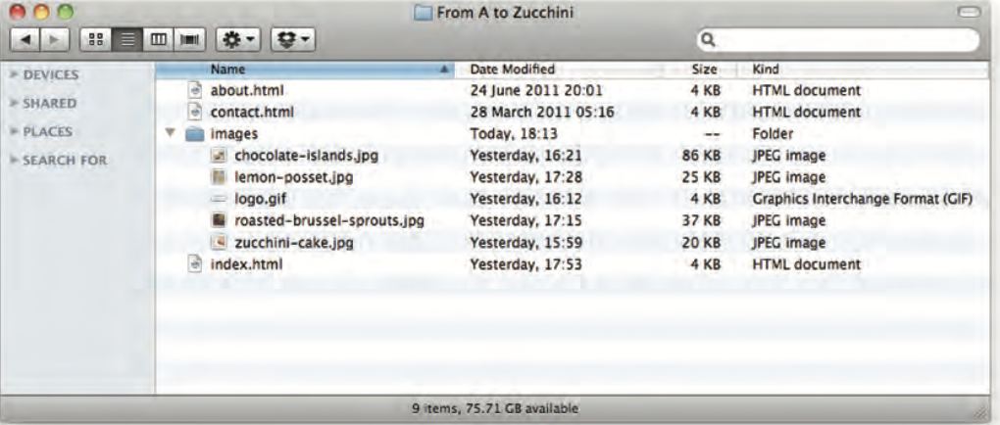

# IMAGES

**CHAPTER 5:**

- There are many reasons why you might want to add an image to a web page: you might want to include a logo, photograph, illustration, diagram, or chart.
There are several things to consider when selecting and preparing images for your site, but taking time to get them right will make it look more attractive and professional.

**Choosing images for your site:**

- A picture can say a thousand words, and great images help make the difference between an average-looking site and a really engaging one.

**Storing images on your site:**

- If you are building a site from scratch, it is good practice to create a folder for all of the images the site uses.

**Adding images:**

- ``
To add an image into the page you need to use an `` element. This is an empty element (which means there is no closing tag). It must carry the following two attributes:

    1- src:
This tells the browser where
it can find the image file. This will usually be a relative URL pointing to an image on your own site. (Here you can see that the images are in a child folder called images — relative URLs were covered on pages 83-84).

    2- alt: This provides a text description of the image which describes the image if you cannot see it.

**Of images :**

- You will also often see an `` element use two other attributes that specify its size:

1- height
This specifies the height of the image in pixels.

2- width
This specifies the width of the image in pixels.

**Where to plaCe Images In Your Code:**

- Where an image is placed
in the code will affect how it is displayed. Here are three examples of image placement that produce different results:

EX. 

**AlignIng images horizontally:**

- The align attribute was commonly used to indicate how the other parts of a page should flow around an image. It has been removed from HTML5
and new websites should use CSS to control the alignment of images.

**Three rules for creating images:**

1- ***Save images In the rIght format:***

- Websites mainly use images in jpeg, gif, or png format. If you choose the wrong image format then your image might not look as sharp as it should and can make the web page slower to load.

2- ***Save images at the right size :***

- You should save the image at the same width and height it will appear on the website. If
the image is smaller than the width or height that you have specified, the image can be distorted and stretched. If the image is larger than the width and height if you have specified, the image will take longer to display on the page.

3- ***Use the correct resolutIon:***

- Computer screens are made up of dots known as pixels. Images used on the web are also made up of tiny dots. Resolution refers to the number of dots per inch, and most computer screens only show web pages at 72 pixels
per inch. So saving images at a higher resolution results in images that are larger than necessary and take longer to download.

**Tools to edit & save images:**

- The most popular tool amongst web professionals is Adobe Photoshop. (In fact, professional web designers often use this software to design entire sites.) The full version of Photoshop is expensive, but there is a cheaper version called Photoshop Elements which would suit the needs of most beginners.

**Image dimensions:**

- The images you use on your website should be saved at the same width and height that you want them to appear on the page.

**CroppIng Images:**

- When cropping images it is important not to lose valuable information. It is best to source images that are the correct shape if possible.

**Image resolution:**

- Images created for the web should be saved at a resolution of 72 ppi. The higher the resolution of the image, the larger the size of the file.

**VeCtor Images:**

- Vector images differ from bitmap images and are resolution-independent. Vector images are commonly created in programs such as Adobe Illustrator.

**Animated gifs:**

- Animated GIFs show several frames of an image in sequence and therefore can be used to create simple animations.

**Figure and figure caption:**

- 1- `<figure>`:

    Images often come with captions. HTML5 has introduced a new <figure> element to contain images and their caption so that the two are associated.
You can have more than one image inside the `<figure>` element as long as they all share the same caption.

- 2- `<figcaption>` :

    The `<figcaption>` element has been added to HTML5 in order to allow web page authors to add a caption to an image.
Before these elements were created there was no way to associate an `` element with its caption.
Older browsers that do not understand HTML5 elements simply ignore the new elements and display the content of them.

----

# COLOR

**CHAPTER 11:**

The color property allows you to specify the color of text inside an element. You can specify any color in CSS in one of three ways:

1- ***rgb values:***

- These express colors in terms of how much red, green and blue are used to make it up. For example: rgb(100,100,90)

2- ***hex Codes:***

- These are six-digit codes that represent the amount of red, green and blue in a color, preceded by a pound or hash # sign. For example: #ee3e80

***Color names:***

- There are 147 predefined color names that are recognized
by browsers. For example: DarkCyan

**Backgroun color:**

- CSS treats each HTML element as if it appears in a box, and the background-color property sets the color of the background for that box.
You can specify your choice of background color in the same three ways you can specify foreground colors: RGB values, hex codes, and color names (covered on the next page).

**Understanding color:**

- Every color on a computer screen is created by mixing amounts of red, green, and blue. To find the color you want, you can use a color picker.

ex. 

**Contrast:**

- When picking foreground and background colors, it is important to ensure that there is enough contrast for the text to be legible.

**Opacity:**

- 1- CSS3 introduces the opacity property which allows you to specify the opacity of an element and any of its child elements. The value is a number between 0.0 and 1.0 (so a value of 0.5
is 50% opacity and 0.15 is 15% opacity).

- 2- The CSS3 rgba property allows you to specify a color, just like you would with an RGB value, but adds a fourth value to indicate opacity. This value is known as an alpha value and is a number between 0.0 and 1.0 (so a value of 0.5 is 50% opacity and 0.15 is 15% opacity). The rgba value will only affect the element on which it is applied (not child elements).

**Css3: hsl & hsla Colors:**

CSS3 introduces an entirely new and intuitive way to specify colors using hue, saturation, and lightness values

 The hsl color property has
been introduced in CSS3 as an alternative way to specify colors. The value of the property starts with the letters hsl, followed
by individual values inside parentheses for:

- hue:

This is expressed as an angle (between 0 and 360 degrees).

- Saturation:

This is expressed as a percentage.

- lightness:

This is expressed as a percentage with 0% being white, 50% being normal, and 100% being black.
The hsla color property allows you to specify color properties using hue, saturation, and lightness as above, and adds a fourth value which represents transparency (just like the rgba property). The a stands for:

- alpha:
This is expressed as a number between 0 and 1.0. For example, 0.5 represents 50% transparency, and 0.75 represents 75% transparency.

---

# TEXT

**CHAPTER 12:**

- The properties that allow you to control the appearance of text can be split into two groups:

    1- Those that directly affect the font and its appearance (including the typeface, whether it is regular, bold or italic, and the size of the text).

    2- Those that would have the same effect on text no matter what font you were using (including the color of text and the spacing between words and letters).

**Typeface terminology:**

- 1- ***Serif:***

Serif fonts have extra details on
the ends of the main strokes of
the letters. These details are
known as serifs.

- 2- ***SanS-Serif:***

    Sans-serif font have stright ends to letters, and therefor have a much cleaner design.

- 3- ***Monospace:***

    Every letter in monospace (or fixed-width)font in the same width.(non-monospace fonts have different widths.)

**ChooSing a typeface for your websiTe:**

- When choosing a typeface, it
is important to understand that a browser will usually only display it if it's installed on that user's computer.

**Techniques that offer a wider choice of typefaces:**

- There are several ways to use fonts. However, typefaces are subject to copyright, so the techniques you can choose from are limited by their respective licenses.

- If you design on a Mac, it is important to check what the typefaces look like on a PC because PCs can render type less smoothly. But if you design on a PC, then it should look fine on a Mac.

**Specifying typefaces(font-family):**

- The font-family property allows you to specify the typeface that should be used for any text inside the element(s) to which a CSS rule applies.
The value of this property is the name of the typeface you want to use.

**Size of tybe(font-size):**

The font-size property enables you to specify a size for the
font. There are several ways to specify the size of a font. The most common are:

- Pixels :

Pixels are commonly used because they allow web designers very precise control over how much space their text takes up. The number of pixels is followed by the letters px.

- Percentages:

The default size of text in browsers is 16px. So a size of 75% would be the equivalent of 12px, and 200% would be 32px.

- Ems:

An em is equivalent to the width of a letter m.

**Type scales:**

- You may have noticed that programs such as Word, Photoshop and InDesign offer the same sizes of text.

**Units of type size:**

**More font choice:**
@font-face

- @font-face allows you to use
a font, even if it is not installed on the computer of the person browsing, by allowing you to specify a path to a copy of the font, which will be downloaded if it is not on the user's machine.
Because this technique allows
a version of the font to be downloaded to the user's computer, it is important that the license for the font permits it to be used in this way.

**Understanding font formats:**

- Different browsers support different formats for fonts
(in the same way that they support different audio and video formats), so you will need to supply the font in several variations to reach all browsers.

**Bold:** 

- Font-weigh:

The font-weight property allows you to create bold text. There are two values that this property commonly takes:

- normal

    This causes text to appear at a normal weight.

- bold

    This causes text to appear bold.

**Italic:**

- font-style:

    If you want to create italic text, you can use the font-style property. There are three values this property can take:

- 1-normal:

    This causes text to appear in a normal style (as opposed to italic or oblique).

- 2-italic:

    This causes text to appear italic.

- 3-oblique:

    This causes text to appear oblique.

**Uppercase &
lowercase:**

- text-transform:

The text-transform property is used to change the case of text giving it one of the following values:

    uppercase:
    This causes the text to appear uppercase.

    lowercase:
    This causes the text to appear lowercase.

    capitalize:
    This causes the first letter of each word to appear capitalized.

**Underline and strike:**

- text-decoration:

    The text-decoration property allows you to specify the following values:

- None:
This removes any decoration already applied to the text.

- Underline:
This adds a line underneath the text.

- Overline:
This adds a line over the top of the text.
- Line-through:
This adds a line through words.
- Blink:
This animates the text to make it flash on and off (however this is generally frowned upon, as it is considered rather annoying).

**leading:**

- line-height:

    Leading (pronounced ledding) is a term typographers use for the vertical space between lines of text. In a typeface, the part of
a letter that drops beneath the baseline is called a descender, while the highest point of a letter is called the ascender. Leading
is measured from the bottom of the descender on one line to the top of the ascender on the next.

**letter & Word spacing:**

- letter-spacing, word-spacing:

    Kerning is the term typographers use for the space between each letter. You can control the space between each letter with the letter-spacing property.
It is particularly helpful to increase the kerning when your heading or sentence is all in uppercase. If your text is in sentence (or normal) case, increasing or decreasing the kerning can make it harder to read.

**Alignment:**

- text-align:

    The text-align property allows you to control the alignment of text. The property can take one of four values:

- Left:

    This indicates that the text should be left-aligned.

- Right:

    This indicates that the text should be right-aligned.

- CenterL:

    This allows you to center text.

- Justify:

    This indicates that every line in a paragraph, except the last line, should be set to take up the full width of the containing box.

**Vertical alignment:**

- vertical-align:

    The vertical-align property is a common source of confusion. It is not intended to allow you to vertically align text in the middle of block level elements such as `
` and `
`, although it does have this effect when used with table cells (the `<td>` and `<th>` elements).

**Indenting text:**

- text-indent:

    The text-indent property allows you to indent the first line of text within an element. The amount you want the line indented by can be specified in a number of ways but is usually given in pixels or ems.

**Drop shadow:**

- text-shadow:

    The text-shadow property has become commonly used despite lacking support in all browsers.
    It is used to create a drop shadow, which is a dark version of the word just behind it and slightly offset. It can also be used to create an embossed effect by adding a shadow that is slightly lighter than the text.
**First letter or line:**

- :first-letter, :first-line:

    You can specify different values for the first letter or first line of text inside an element using :first-letter and :first-line.
    Technically these are not properties. They are known as pseudo-elements.

**Styling inks:**

- :link, :visited:

    Browsers tend to show links
in blue with an underline by default, and they will change the color of links that have been visited to help users know which pages they have been to.
In CSS, there are two pseudo- classes that allow you to set different styles for links that have and have not yet been visited.

    :link:
This allows you to set styles for links that have not yet been visited.

    :visited
This allows you to set styles for links that have been clicked on.
They are commonly used to control colors of the links and also whether they are to appear underlined or not.

**Responding to users:**

- There are three pseudo-classes that allow you to change the appearance of elements when a user is interacting with them.

- 1-hover:

    This is applied when a user hovers over an element with a pointing device such as a mouse. This has commonly been used to change the appearance of links and buttons when a user places their cursor over them. It is worth noting that such events do not work on devices that use touch screens (such as the iPad) because the screen is not able to tell when someone is hovering their finger over an element.

- 2-active:

    This is applied when an element is being activated by a user; for example, when a button is being pressed or a link being clicked. Sometimes this is used to make a button or link feel more like it is being pressed by changing the style or position of the element slightly.

- 3-focus:

    This is applied when an element has focus. Any element that you can interact with, such as a link you can click on or any form control can have focus.