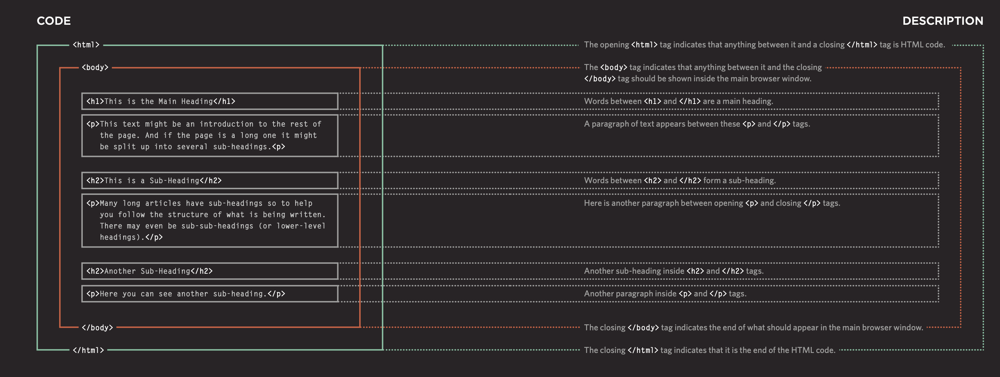
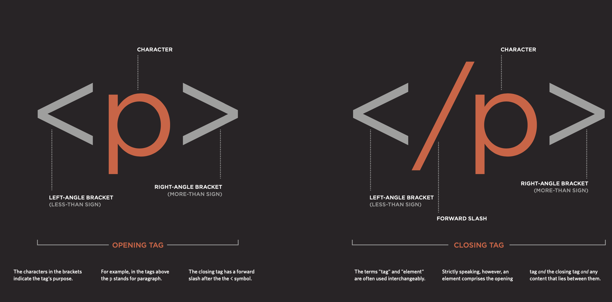

**CHAPTER 1**
# Structure :

- structure is very important in helping readers to understand the messages you are trying to convey and to navigate around the document.

**How pages use structure :**

-   For each story, there will be a headline, some text, and possibly some images. If the article is a long piece, there may be subheadings that split the story into separate sections or quotes from those involved. The structure is very similar when a news story is viewed online (although it may also feature audio or video).

**Structuring word documents :**

- The use of headings and subheadings in any document often reflects a hierarchy of information.

**Html uses elements to describe the structure of pages :**

**a cLoser look at tags :**

**Attributes teLL us more about eLements :**

Attributes provide additional information about the contents of an element. They appear on the opening tag of the element and are made up of two parts: a name and a value, separated by an equals sign.

- 1- The attribute name indicates what kind of extra information you are supplying about the element's content. It should be written in lowercase.
- 2- The value is the information
or setting for the attribute. It should be placed in double quotes. Different attributes can have different values.

**body, Head & titLe :**

***Body :***  
- You met the body element
in the first example we created. Everything inside this element is shown inside the main browser window.

***Head :***
- Before the body element you will often see a head element. This contains information
about the page (rather than information that is shown within the main part of the browser window that is highlighted in blue on the opposite page).
You will usually find a title element inside the head element.

**Title :
- The contents of the title element are either shown in the top of the browser, above where you usually type in the URL of the page you want to visit, or
on the tab for that page (if your browser uses tabs to allow you to view multiple pages at the same time).
 
**Code in a content management SyStem :**
- If you are working with a content management system, blogging platform, or e-commerce application, you will probably log into a special administration section of the website to control it. The tools provided in the administration sections of these sites usually allow you to edit parts of the page rather than
the entire page, which means you will rarely see the <html>, <head>, or <body> elements.
---

- HTML pages are text documents.
- HTML uses tags (characters that sit inside angled brackets) to give the information they surround special meaning.
- Tags are often referred to as elements.
- Tags usually come in pairs. The opening tag denotes the start of a piece of content; the closing tag denotes the end.
- Opening tags can carry attributes, which tell us more about the content of that element.
- Attributes require a name and a value.
- To learn HTML you need to know what tags are available for you to use, what they do, and where they can go.

---
**CHAPTER 8**
# The evolution of HTML

- Since the web was first created, there have
been several different versions of HTML. Each new version was designed to be an improvement by adding and removing elements and attributes.

- Not all web users will be able to view all of the latest features and
Markup as there are several versions of each browser used to view web pages (browsers not supporting certain features).

**HTML4 released 1997 :**

**XHTML 1.0 released 2000 :**

- to allow people to write new markup languages. HTML 4 should be reformulated to follow the rules of XML. This meant that authors had to follow more strict rules when writing markup. For example:

-  1- A closing tag (except for empty elements such as < img />).

- 2- Attribute names had to be in lowercase.

- 3- All attributes required a value, and all values were to be placed in double quotes.

- 4- Deprecated elements should no longer be used.

- 5- Every element that was opened inside another element should be closed inside that same element.

**HTML5 released 2000 :**

In HTML5, web page authors do not need to close all tags, and new elements and attributes will be introduced. writing, the HTML5 specification had not been completed.

***DOCTYPEs:***

DOCTYPE declaration to tell a browser which version of HTML the page is using : 

- HTML5
<! DOCTYPE html>

- HTML4
<! DOCTYPE html PUBLIC "-//W3C//DTD HTML 4.01 Transitional//EN" "http://www.w3.org/TR/html4/loose.dtd"> 
- Transitional XHTML 1.0
<! DOCTYPE html PUBLIC "-//W3C//DTD XHTML 1.0 Transitional//EN" "http://www.w3.org/TR/xhtml1/DTD/xhtml1-transitional.dtd">

- Strict XHTML 1.0
<! DOCTYPE html PUBLIC "-//W3C//DTD XHTML 1.0 Strict//EN" "http://www.w3.org/TR/xhtml1/DTD/ xhtml1-strict.dtd">

- XML Declaration
< ?xml version="1.0" ?>

**Comments in HTML : <!-- -->**

- Comments in HTML won’t be visible in the user’s browser. They can be viewed by anyone who looks at the source code behind the page.

- Comments should be added to describe the code to be easier to understand when you come back to it or when someone reads it.
Example: 

  ( <! -- comment goes here --> )

**ID Attribute :**

- It can be used with any HTML element  to uniquely identify that element from other elements on the page.
Giving an element a unique identity allows you to style it differently than any other Instance in the page
id attributes can be used to allow the script to work with that particular element which allows you to add interactivity to your pages.

**Class Attribute :**

- Every HTML element can also carry a class attribute. Sometimes, rather than uniquely identifying one element within a document.
The class attribute on any element can share the same value. It will only change their appearance if there is a CSS rule affecting the class.

- Block Elements
Blokes are the elements that will always appear to start on a new line in the browser window.
Examples of block elements are
< h1>, < p>, < ul>, and < l  i>.

**Inline Elements :**

- Inline elements will always appear to continue on the same line as their neighbouring elements.
Examples of inline elements are
< a>, < b>, < em>, and < img>.

**Grouping Text & Elements In a Block :**

- The < div> element allows you to group a set of elements together in one block-level box.

**Grouping Text & Elements Inline :**

- The  element acts like an inline equivalent of the 
 element. 

**IFrames :**

- An iframe is like a little window that has been cut into your page — and in that window you can see another page.

- 1- src :

  The src attribute specifies the URL of the page to show in the frame.

- 2- height :

  The height attribute specifies the height of the iframe in pixels.

- 3- width :

  The width attribute specifies the width of the iframe in pixels.

**Information About Your Pages:**

- The < meta> element lives inside the < head> element and contains information about that web page.

---
**CHAPTER 17** 
# HTML5 

- HTML5 is introducing a new set of elements that help define the structure of a page. Older browsers that do not understand HTML5 elements need to be told which elements are
block-level elements. To make HTML5 elements work in Internet Explorer 8 (and older versions of IE), extra JavaScript is needed, which is available free from Google.

**Headers < header> & Footer < footer> :**

- The main hea 
der or footer
that appears at the top or
bottom of every page on the
site.

-  A header or footer for an
individual < article> or
< section> within the page.

**Navigation :**

- The < nav> element is used to contain the major navigational blocks on the site such as the primary site navigation.

**Articles < article> :**

- The < article> element acts as a container for any section of a page that could stand alone and potentially be syndicated.

**Aside < aside> :**

- The < aside> element has two purposes, depending on whether it is inside an < article> element or not.

**Sections < section> :**

- The < section> element groups related content together, and typically each section would have its own heading.

**Heading Groups < hgroup> :**

- The purpose of the < hgroup> element is to group together a set of one or more < h1> through < h6> elements so that they are treated as one single heading.

**Figures < figure> < figcaption> :**

- ***To display a figure could be:***

- 1- Images
- 2- Videos
- 3- Graphs
- 4- Diagrams
- 5- Code samples
- Text that supports the main body of an article
The < figure> element should also contain a < figcaption> element which provides a text description for the content of the < figure> element.

---
**( CHAPTER 18 )**
# This section discusses a process that you can use when you are creating a new website. 
- It looks at who might be visiting your site and how to ensure the pages feature the information those visitors need. It also covers some key aspects of design theory to help you create professional looking sites. In this chapter , lock at this :

-------------- 

**Who is the site For?**

*Every website should be designed for the target audience—not just for yourself or the site owner. It is therefore very important to understand who your target audience is.*

**Target audience for this :**

*1 - nDiviDuals .*  
*2 - comPanies .*

**Why People visit your website:**

*1 - The first attempts to discover the underlying motivations for why visitors come to the site.*

*2 - The second examines the specific goals of the visitors. These are the triggers making them come to the site now.*

**What your visitors are trying to achieve :**

*You want to create a list
of reasons why people would be coming to your site.*

**What inFormation your visitors neeD :**

*You know who is coming to your site and why they are coming, so now you need to work out what information they need in order to achieve their goals quickly and effectively like :*

- You may want to offer additional supporting information that you think they might find helpful.
- Look at each of the reasons why people will be visiting your site and determine what they need to achieve their goals.
- You can prioritize levels of information from key points down to non-essential or background information.
- By ensuring that you provide the information that your visitors are looking for, they will consider your site more relevant to them.

**How often people Will visit your site :**

- A website will need to change a  frequently .

**Site maps :**

*The aim is to create a diagram of the pages that will be used to structure the site. This is known as a site map and it will show how those pages can be grouped.*

**WireFrames :**

*A wireframe is a simple sketch of the key information that needs to go on each page of a site. It shows the hierarchy of the information and how much space it might require.*

**Getting your message across using Design :**

- The primary aim of any kind of visual design is to communicate. Organizing and prioritizing information on a page helps users understand its importance and what order to read it in.

**visual hierarchy :**  

 - 1- *Size
Larger elements will grab users' attention first. For this reason it is a good idea to make headings and key points relatively large.*

- 2- *color
Foreground and background color can draw attention to key messages. Brighter sections tend to draw users' attention first.*

- 3- *style
An element may be the same size and color as surrounding content but have a different style applied to it to make it stand out.*

**Grouping and similarity :**
- *We naturally observe similarities in design, and things that are similar are perceived to be more related than things that are dissimilar. Repetition
of similar color, size, orientation, texture, font, or shape, suggests that matching elements have similar importance or meaning.*

**Designing navigation:**

- *ite navigation not only helps people find where they want to go, but also helps them understand what your site is about and how it is organized. Good navigation tends to follow these principles.*
---

**JAVASCRIPT SUMMARY**

**Introduction**
 
# How javascript makes web pages more interactive :
 
  - 1- *ACCESS CONTENT* :  

You can use JavaScript to select any element, attribute, or text from an HTML page
 .
- 2- *MODIFY CONTENT* :

You can use JavaScript to add elements, attributes, and text to the page, or remove them .
 
 - 3- *PROGRAM RULES* :
  

You can specify a set of steps for
the browser to follow (like a recipe), which allows it to access or change the content of a page .

- 4- *REACT TO EVENTS* :

You can specify that a script should run when a specific event has occurred .
***

 **Before you learn how to read and write the JavaScript
 you need to become familiar with some key concepts in computer programming. They will be covered in three sections :**

**THE ABC OF PROGRAMMING :**

**Before you learn how to read and write the JavaScript
 you need to become familiar with some key concepts in computer programming. They will be covered in three sections :**

- 1- **What is a script and how do i create one ?**

A script is a series of instructions that a computer can follow to achieve a goal.

- 2- **How do computers fit in with the world around them?**

- 3- **How do I write a script for a wep page ?**

To write a script, you need to :

- A- Define the goal .
- B- Design the script .
- C- Code each step .

***
# RULES FOR NAMING VARIABLES :

- 1- The name must begin with
a letter, dollar sign ($),or an underscore (_). It must not start with a number.

- 2- The name can contain letters, numbers, dollar sign ($), or an underscore (_). Note that you must not use a dash(-) or a period (.) in a variable name.

- 3- You cannot use keywords or reserved words. Keywords are special words that tell the interpreter to do something .

- 4- All variables are case sensitive, so score and Score would be different variable names, but
it is bad practice to create two variables that have the same name using different cases.

- 5- Use a name that describes the kind of information that the variable stores .

- 6- If your variable name is made up of more than one word, use a capital letter for the first letter of every word after the first word.

*** 
**Arrays :**

- An array is a special type of variable. It doesn't just store one value; it stores a list of values.

**VALUES IN ARRAYS :**

- Values in an array are accessed as if they are in a numbered list. It is important to know that the numbering of this list starts at zero (not one).

***
**EXPRESSIONS :**

An expression evaluates into (results in) a single value. Broadly speaking there are two types of expressions :

- 1- Expressions that just assign a value to a variable .

- 2- Expresstions that use tow or more values to return a single value .
