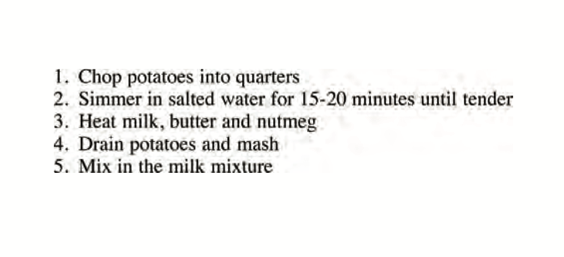
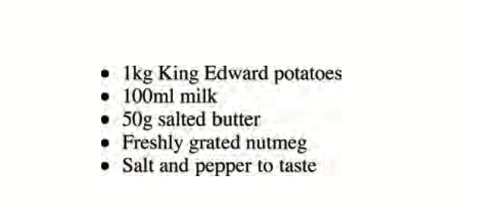
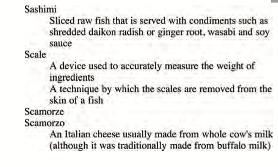

**CHAPTER 3**

# LISTS

There are lots of occasions when we need to use lists. HTML provides us with three different types:
    
- 1- ***Ordered lists:*** 
    - are lists where each item in the list is numbered.

    EX . 

- 2- ***Unordered lists:***
     - are lists that begin with a bullet point (rather than characters that indicate order).
    
    EX. 

- 3- ***Definition lists:***
     - are made up of a set of terms along with the definitions for each of those terms.

     EX. 

---

**CHAPTER 13**

# BOXES

**Box Dimensions:**
width, height
- **By default a box is sized just big enough to hold its contents. To set your own dimensions for a box you can use the height and width properties.
The most popular ways to specify the size of a box are
to use pixels, percentages, or ems. Traditionally, pixels have been the most popular method because they allow designers to accurately control their size.

**limiting Width:**
 min-width, max-width
- Some page designs expand and shrink to fit the size of the user's screen. In such designs, the min-width property specifies the smallest size a box can be displayed at when the browser window is narrow, and the max-width property indicates the maximum width a box can stretch to when the browser window is wide.
These are very helpful properties to ensure that the content of pages are legible (especially on the smaller screens of handheld devices). For example, you can use the max-width property to ensure that lines of text do not appear too wide within a big browser window and you can use the min-width property
to make sure that they do not appear too narrow.

**Overflowing contnet:**

- Overflow :
    - The overflow property tells the browser what to do if the content contained within a box is larger than the box itself. It can have one of two values:
        - Hidden:

            This property simply hides any extra content that does not fit in the box.
        - Scroll:
        
             This property adds a scrollbar to the box so that users can scroll to see the missing content.

**Border, margin & padding:**

- 1- Border: Every box has a border (even if it is not visible or is specified to be 0 pixels wide). The border separates the edge of one box from another
- 2- Margin:
Margins sit outside the edge
of the border. You can set the width of a margin to create a gap between the borders of two adjacent boxes.
- 3- Padding:
Padding is the space between the border of a box and any content contained within it. Adding padding can increase the readability of its contents.

EX. 

**White space & vertical margin:**

- The padding and margin properties are very helpful in adding space between various items on the page.

**Border width:** border-width
- The border-width property is used to control the width of a border. The value of this property can either be given in pixels or using one of the following values:

    1- thin

    2- medium

    3- thick

    (You cannot use percentages with this property.)
You can control the individual size of borders using four separate properties:

   1- border-top-width
  
   2-border-right-width
  
   3-border-bottom-width
  
   4-border-left-width

**Border style:**
border-style
- You can control the style of a border using the border-style property. 

**Border color:**
border-color
- 
You can specify the color of a border using either RGB values, hex codes or CSS color names (as you saw on pages 251-252).

**Shorthand:**
border
- The border property allows you to specify the width, style and color of a border in one property (and the values should be coded in that specific order).

**Padding:**
- The padding property allows you to specify how much space should appear between the content of an element and its border.

**Margin:**
- The margin property controls the gap between boxes. Its value is commonly given in pixels, although you may also use percentages or ems.
If one box sits on top of another, margins are collapsed , which means the larger of the two margins will be used and the smaller will be disregarded.

**Creating content:**
- If you want to center a box on the page (or center it inside the element that it sits in), you can set the left-margin and right-margin to auto.
In order to center a box on the page, you need to set a width for the box (otherwise it will take up the full width of the page).

**IE6 box model:**
- When you specify the width of a box, any padding or margin should be added to the width of it. Internet Explorer 6, however, has a quirk whereby it includes the padding and margins in the width of the box.

**Change inline/block:**

- The display property allows you to turn an inline element into a block-level element or vice versa, and can also be used to hide an element from the page.

**Hiding boxes:**
- The visibility property allows you to hide boxes from users but It leaves a space where the element would have been.

**Border image:**
- The border-image property applies an image to the border of any box. It takes a background image and slices it into nine pieces.

**Box shadows:**

- The box-shadow property allows you to add a drop shadow around a box. It works just like the text-shadow property.

**Reounded corners:**
- introduces the ability to create rounded corners on any box, using a property called border-radius. The value indicates the size of the radius in pixels.

**Elliptical shapes:**
- To create more complex shapes, you can specify different distances for the horizontal and the vertical parts of the rounded corners .

---
**CHAPTER 2**

# BASIC JAVA SCRIPT

**ARRAYS :**

- An array is a special type of variable. It doesn't just store one value; it stores a list of values.

***CREATING AN ARRAY :***
- You create an array and give it
a name just like you would any other variable (using the var keyword followed by the name of the array).

***VALUES IN ARRAYS :***
- Values in an array are accessed as if they are in a numbered list. It is important to know that the numbering of this list starts at zero (not one).