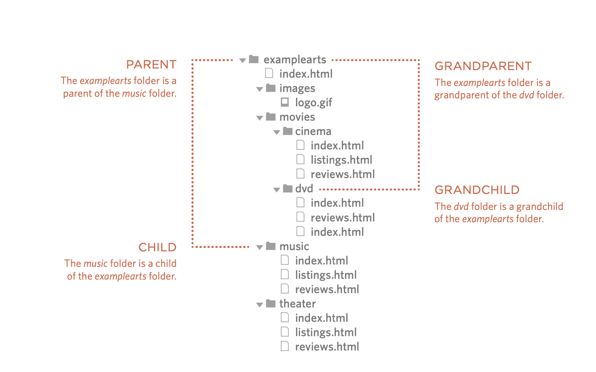
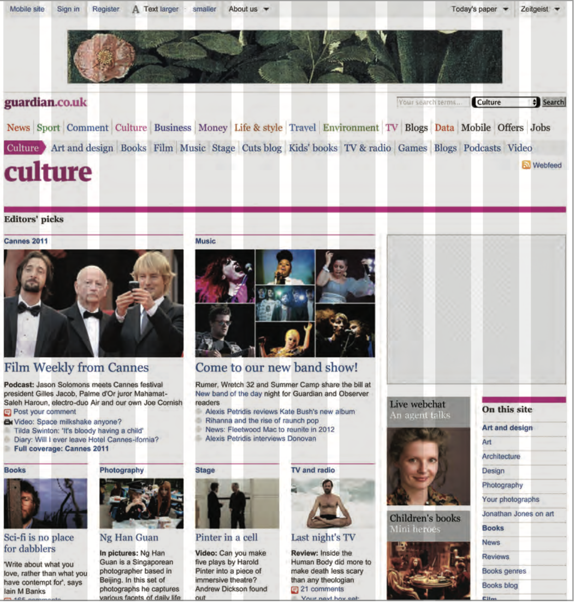

# LINKS

**CHAPTER 4:**

---

* Links are the defining feature of the web because they allow you to move from one web page to another, enabling the very idea of browsing or surfing.

**Writing Links:**

*Links are created using the `<a>` element. Users can click on anything between the opening `<a>` tag and the closing `</a>` tag. You specify which page you want to link to using the href attribute.*

**Linking to other sites:**

*`<a>`
Links are created using the `<a>` element which has an attribute called href. The value of the href attribute is the page that you want people to go to when they click on the link.*

**linking to the other pages on the same site:**

When you are linking to other pages within the same site,
you do not need to specify the domain name in the URL. You can use a shorthand known as a relative URL.

**Directory structure:**

On larger websites it's a good idea to organize your code by placing the pages for each different section of the site into a new folder. Folders on a website are sometimes referred to as directories.

**Relative urls:**

Relative URLs can be used when linking to pages within your own website. They provide a shorthand way of telling the browser where to find your files.

**EMAiL Links:**

To create a link that starts up
the user's email program and addresses an email to a specified email address, you use the `<a>` element. However, this time the value of the href attribute starts with mailto: and is followed by the email address you want the email to be sent to.

**Opening inks n a new weindow:**
If you want a link to open in a new window, you can use the target attribute on the opening `<a>` tag. The value of this attribute should be _blank.

**Linking to a specific part of the same page:**

At the top of a long page
you might want to add a list
of contents that links to the corresponding sections lower down. Or you might want to add a link from part way down the page back to the top of it to save users from having to scroll back to the top.

**Linking to a specific part of another page:**

If you want to link to a specific part of a different page (whether on your own site or a different website) you can use a similar technique.

---

# Layout

**CHAPTER 15:**

**Key ConCepts in positioning eLements**

Building Blocks:

- Css treats each HTML element as if it is in its own box. This box will either be a block-level box or an inline box.

containing Elements :

- If one block-level element sits inside another block-level element then the outer box is known as the containing or parent element.

**ControLLing the position of eLements:**

- CSS has the following positioning schemes that allow you to control the layout of a page: normal flow, relative positioning, and absolute positioning. You specify the positioning scheme using the position property in CSS. You can also float elements using the float property.

**nrotrNormal flow:**

- In normal flow, each block-level element sits on top of the next one. Since this is the default way in which browsers treat HTML elements, you do not need a CSS property to indicate that elements should appear
in normal flow, but the syntax would be:
position: static;
I have not specified a width property for the heading element, so you can see how it stretches the width of the entire browser window by default.

**ReLative positioning:**

- Relative positioning moves an element in relation to where it would have been in normal flow.

**Absolute positioning:**

- When the position property is given a value of absolute, the box is taken out of normal flow and no longer affects the position of other elements on the page. (They act like it is not there.)
The box offset properties (top or bottom and left or right) specify where the element should appear in relation to its containing element.

**Fixed positioning:**

- Fixed positioning is a type of absolute positioning that requires the position property to have a value of fixed

**overLapping elements:**

- When you use relative, fixed, or absolute positioning, boxes can overlap. If boxes do overlap, the elements that appear later in the HTML code sit on top of those that are earlier in the page.
If you want to control which element sits on top, you can use the z-index property. Its value is a number, and the higher the number the closer that element is to the front. For example, an element with a z-index of 10 will appear over the top of one with a z-index of 5 

**Floating elements:**

- The float property allows you to take an element in normal flow and place it as far to the left or right of the containing element as possible. Anything else that sits inside the containing element will flow around the element that is floated.
When you use the float property, you should also use the width property to indicate how wide the floated element should be. If you do not, results can be inconsistent but the box is likely to take up the full width of the containing element (just like it would in normal flow). 

**screen sizes :**

- Different visitors to your site will have different sized screens that show different amounts of information, so your design needs to be able to work on a range of different sized screens.

**sCreen resoLution :**

- Resolution refers to the number of dots a screen shows per inch. Some devices have a higher resolution than desktop computers and most operating systems allow users to adjust the resolution of their screens.

**page sizes:**

- Because screen sizes and display resolutions vary so much, web designers often try to create pages of around 960-1000 pixels wide (since most users will be able to see designs this wide on their screens).

**Fixed width Layouts:**

- Fixed width layout designs do not change size as the user increases
or decreases
the size of their browser window. Measurements tend to be given in pixels.

**Liquid Layouts:**

Liquid layout designs stretch and contract as the user increases or decreases the size of their browser window. They tend to use percentages.

**a fixde width Layout:**

- To create a fixed width layout, the width of the main boxes on a page will usually be specified in pixels (and sometimes their height, too).

**A liquid layout:**

- The liquid layout uses percentages to specify the width of each box so that the design will stretch to fit the size of the screen.

**Layout grids:**

- Composition in any visual art (such as design, painting, or photography) is the placement or arrangement of visual elements — how they are organized on a page. Many designers use a grid structure to help them position items on a page, and the same is true for web designers.

EX. 

**Css frameworks:**

- CSS frameworks aim to make your life easier by providing the code for common tasks, such as creating layout grids, styling forms, creating printer-friendly versions of pages and so on. You can include the CSS framework code in your projects rather than writing the CSS from scratch.

---

# Functions Methods and Objects

**WHAT IS A FUNCTION?**

- Functions let you group a series of statements together to perform a specific task. If different parts of a script repeat the same task, you can reuse the function (rather than repeating the same set of statements).

**DECLARING A FUNCTION:**

- To creat a function, you give it a name and then write the statements needed ti achieve its task inside the curly braces.

**CALLING A FUNCTION:**

- Having declared the function, you can then execute all of the statements btween its curly braces with just one line of code.

**GETTING A SINGLE VALUE OUT OF A FUNCTION:**

- Some functions return information to the code that called them.

**GETTING MULTIPLE VALUES OUT OF A FUNCTION:**

- Functions can return more than one value using an array.

**ANONYMOUS FUNCTIONS & FUNCTION EXPRESSIONS:**

- 
Expressions produce a value. They can be used where values are expected. If a function is placed where a browser expects to see an expression,
(e.g., as an argument to a function), then it gets treated as an expression.

**VARIABLE SCOPE:**

- The location where you declare a variable will affect where it can be used within your code. If you declare it within a function, it can only be used within that function. This is known as the variable's scope.

---
**6 Reasons for Pair Programming**

Iterative loops. Code reviews. Fast feedback. Error checking and linting.

More “two heads are better than one” than “stop reading over my shoulder,” pair programming is the practice of two developers sharing a single workstation to interactively tackle a coding task together.

**How does pair programming work?**

- While there are many different styles, pair programming commonly involves two roles: the Driver and the Navigator. The driver is the programmer who is typing and writing the code.
The Navigator uses their words to guide the Driver but does not provide any direct input to the computer. The Navigator thinks about the big picture and utilize their computer to look up solutions and documentation should not be writing any code.

**Why pair program?**

- Four fundamental skills that help anyone learn a new language: Listening: hearing and interpreting the vocabulary Speaking.

    During a five-hour paired lab session, Code Fellows students work on all four of these language-specific skills.

Wow, all that? Let’s take a look!

1. Greater efficiency
It is a common misconception that pair programming takes a lot longer and is less efficient.
2. Engaged collaboration
When two programmers focus on the same code, the experience is more engaging and both programmers are more focused than if they were working alone.
3. Learning from fellow students
Everyone has a different approach to problem solving; working with a teammate can expose developers to techniques they otherwise would not have thought of.
4. Social skills
Pair programming is great for improving social skills.
5. Job interview readiness
A common step in many interview processes involves pair programming between a current employee and an applicant, either in person or through a shared screen.
6. Work environment readiness
Many companies that utilize pair programing expect to train fresh hires from CS-degree programs on how they operate to actually deliver a product.