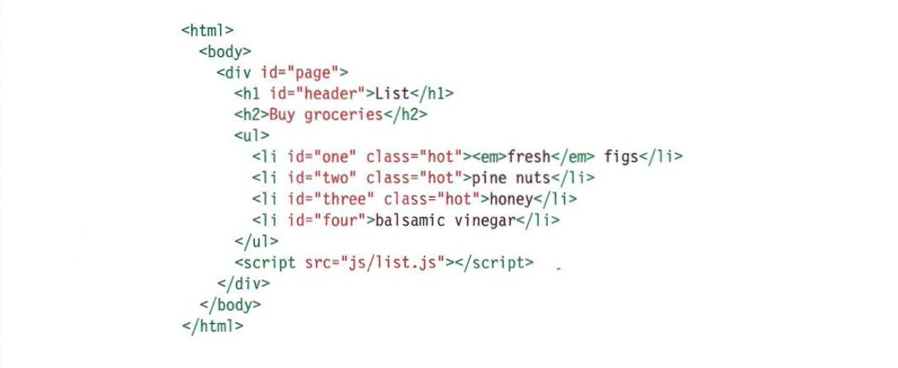

# Object literals

**WHAT IS AN OBJECT?**

- Objects group together a set of variables and functions to create a model of a something you would recognize from the real world. In an object, variables and functions take on new names.

IN AN OBJECT:

VARIABLES BECOME KNOWN AS PROPERTIES
If a variable is part of an object, it is called a property. Properties tell us about the object.

IN AN OBJECT:

FUNCTIONS BECOME KNOWN AS METHODS
If a function is part of an object, it is called a method. Methods represent tasks that are associated with the object.

**CREATING AN OBJECT:**

- LITERAL NOTATION :
Literal notation is the easiest and most popular way to create objects(there are several ways to create objects)

- ACCESSING AN OBJECT AND DONT NATATION:

    You access the properties or methods of an object using dot notation. You can also access properties using square brachets.

---

# DOCUMENT OBJECT MODEL

- THe Document Object Model (DOM) specifies
how browsers should create a model of an HTML
page and how JavaScript can access and update the contents of a web page while it is in the browser window.

**THE DOM TREE IS A MODEL OF A WEB PAGE:**

- As a browser loads a web page, it creates a model of that page.
The model is called a DOM tree, and it is stored in the browsers' memory. It consists of four main types of nodes.

- Attribute nodes:
    The opening tags of HTML elements can carry attributes and these are represented by attribute nodes in the DOM tree.
    Attribute nodes are not children of the element thar carries them; they are partofthat element. Once you access an element, there are specific JavaScript methods and properties to read or change that element's attributes. For example, it is common to change the values of cl ass attributes to trigger new CSS rules that affect their presentation.

- TEXT NODES:

    Once you have accessed an element node, you
    can then reach the text within that element. This is stored in its own text node.
    Text nodes cannot have children. If an element contains text and another child element, the child element is not a child of the text node but rather
    a child of the containing element. (See the `<em>` element on the first `<l i >` item.) This illustrates how the text node is always a new branch of the DOM tree, and no further branches come off of it.

**WORKING WITH THE DOM TREE:**

- Accessing and updating the DOM tree involves two steps:

    1- Locate the node that represents the element you want to work with.

    2- Use its text content, child elements, and attributes.

**CACHING DOM QUERIES:**

- Methods that find elements in the DOM tree called DOM queries. When you need ti work with an element more than once, you should use a variable to store the result of this query.

**ACCESSING ELEMENTS:**

- DOM queries may return one element, or they may return a Nodelist, which is a collection of nodes.

**METHODS THAT SELECT INDIVIDUAL ELEMENTS:**

- getElenentById() and querySelector() can both search an entire document and return individual elements. Both use a similar syntax.

**SELECTING AN ELEMENT FROM A NODELIST:**

- There are two ways to select an element from a Nodelist: The item() method and array syntax.
Both require the index number of the element you want.

    1- THE item METHOD:
- Nodelists have a method
called item() which will return an individual node from the Nodelist.

    2- ARRAY SYNTAX:
- You can access individual nodes using a square bracket syntax similar to that used to access individual items form an array.

**SELECTING ELEMENTS USING CLASS ATTRIBUTES:**

- The getElementsByClassName() method allows you to select elements whose c1ass attribute contains a specific value.

- The method has on parameter :
     the class name which is given in quotes within the parentheses after the method name.

- Because several elements can have the same value for their cl ass attribute, this method always returns a Nodelist.

**SELECTING ELEMENTS BY TAG NAME:**

- The getEl ementsByTagName() method allows you to select elements using their tag name.

- The element name is specified as a parameter, so it is placed inside the parentheses and is contained by quote marks.

- Note that you do not include the angled brackets that surround the tag name in the HTML (just the letters inside the brackets).

**SELECTING ELEMENTS USING CSS SELECTORS:**

- querySe1ector() returns
the first element node that matches the CSS-style selector. querySe1ectorA11() returns a Nodelist of all of the matches.

- Both methods take a CSS selector as their only parameter. The CSS selector syntax offers more flexibility and accuracy when selecting an element than.

- just specifying a class name or a tag name, and should also be familiar to front-end web developers who are used to targeting elements using CSS.

**REPEATING ACTIONS FOR AN ENTIRE NODELIST:*

- When you have a nodelist, you can loop through each node in the cillection and apply the same statements to each.

**LOOPING THROUGH A NODELIST:**

- If you want to apply the same code to numerous elements, looping through a Nodelist is a powerful technique.

- It involves finding out how many items are in the Nodelist, and then setting a counter to loop through them, one-by-one.

- Each time the loop runs, the script checks that the counter is less than the total number of items in the Nodelist.

**TRAVERSING THE DOM:**

- When you have an element node, you can select another element in relation to it using these five properties. This is known as traversing the DOM.

**WHITESPACE NODES:**

- Traversing the DOM can be difficult because some browsers add a text node whenever they come across whitespace between elements.

**PREVIOUS & NEXT SIBLING:**

- You have just seen that
these properties can return inconsistent results in different browsers. However, it is safe
to use them when there is no whitespace between elements.

**FlRST & LAST CHILD:**

- These properties also return inconsistent results if there is whitespace between elements. Inthis example, a slightly different solution is used in the HTML - the closing tags are put next to the opening tags of the next element, making it a little more readable.

