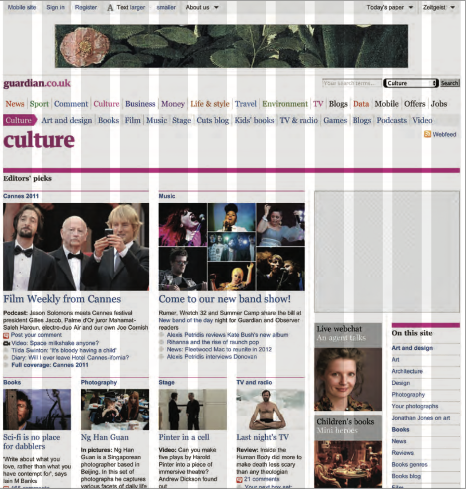

# Layout

**CHAPTER 15:**

**Key ConCepts in positioning eLements**
Building Blocks:

- Css treats each HTML element as if it is in its own box. This box will either be a block-level box or an inline box.

containing Elements :

- If one block-level element sits inside another block-level element then the outer box is known as the containing or parent element.

**ControLLing the position of eLements:**

- CSS has the following positioning schemes that allow you to control the layout of a page: normal flow, relative positioning, and absolute positioning. You specify the positioning scheme using the position property in CSS. You can also float elements using the float property.

**nrotrNormal flow:**

- In normal flow, each block-level element sits on top of the next one. Since this is the default way in which browsers treat HTML elements, you do not need a CSS property to indicate that elements should appear
in normal flow, but the syntax would be:
position: static;
I have not specified a width property for the heading element, so you can see how it stretches the width of the entire browser window by default.

**ReLative positioning:**

- Relative positioning moves an element in relation to where it would have been in normal flow.

**Absolute positioning:**

- When the position property is given a value of absolute, the box is taken out of normal flow and no longer affects the position of other elements on the page. (They act like it is not there.)
The box offset properties (top or bottom and left or right) specify where the element should appear in relation to its containing element.

**Fixed positioning:**

- Fixed positioning is a type of absolute positioning that requires the position property to have a value of fixed

**overLapping elements:**

- When you use relative, fixed, or absolute positioning, boxes can overlap. If boxes do overlap, the elements that appear later in the HTML code sit on top of those that are earlier in the page.
If you want to control which element sits on top, you can use the z-index property. Its value is a number, and the higher the number the closer that element is to the front. For example, an element with a z-index of 10 will appear over the top of one with a z-index of 5 

**Floating elements:**

- The float property allows you to take an element in normal flow and place it as far to the left or right of the containing element as possible. Anything else that sits inside the containing element will flow around the element that is floated.
When you use the float property, you should also use the width property to indicate how wide the floated element should be. If you do not, results can be inconsistent but the box is likely to take up the full width of the containing element (just like it would in normal flow).

**screen sizes :**

    - Different visitors to your site will have different sized screens that show different amounts of information, so your design needs to be able to work on a range of different sized screens.

**sCreen resoLution :**

- Resolution refers to the number of dots a screen shows per inch. Some devices have a higher resolution than desktop computers and most operating systems allow users to adjust the resolution of their screens.

**page sizes:**

- Because screen sizes and display resolutions vary so much, web designers often try to create pages of around 960-1000 pixels wide (since most users will be able to see designs this wide on their screens).

**Fixed width Layouts:**

- Fixed width layout designs do not change size as the user increases
or decreases
the size of their browser window. Measurements tend to be given in pixels.

**Liquid Layouts:**

Liquid layout designs stretch and contract as the user increases or decreases the size of their browser window. They tend to use percentages.

**a fixde width Layout:**

- To create a fixed width layout, the width of the main boxes on a page will usually be specified in pixels (and sometimes their height, too).

**A liquid layout:**

- The liquid layout uses percentages to specify the width of each box so that the design will stretch to fit the size of the screen.

**Layout grids:**

- Composition in any visual art (such as design, painting, or photography) is the placement or arrangement of visual elements — how they are organized on a page. Many designers use a grid structure to help them position items on a page, and the same is true for web designers.

EX. 

**Css frameworks:**

- CSS frameworks aim to make your life easier by providing the code for common tasks, such as creating layout grids, styling forms, creating printer-friendly versions of pages and so on. You can include the CSS framework code in your projects rather than writing the CSS from scratch.
